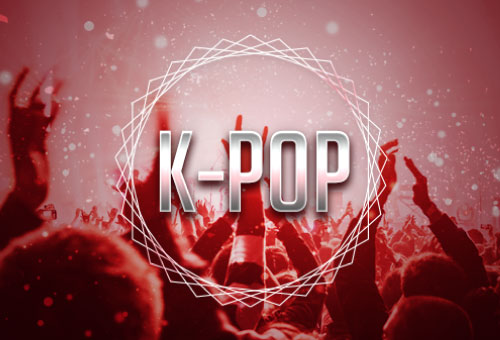

# 개요

제 누구나 다 아는 K-POP(Korean Popular Music) 이라는 단어와 그  위상은 날로 높아져 가고, 전 세계의 음악계를 흔들 정도로 고유대명사로 인정되었다.

세계적으로 인정받는 K-POP의 흐름이 계속되기 위해서는 급변하는 시대의 흐름에 맞춰 K-POP의 인기를 가능하게 하는 팬들에게 새로운 콘텐츠가 제공되어는 지속 가능한 성장 모델이 있어야 한다.

이미 COVID-19의 팬더믹 사태로 인해 콘서트, 공연 등의 대면 서비스가 어려워짐에 따라 비대면으로 가능한 메타버스, NFT 등 디지털 시장이 커지며 국내 엔터테인먼트 비즈니스 구조도 더욱 디지털화에 비중을 높이는 추세에 있다.

&#x20;대한민국의 대표적인 대형 엔터테인먼트사인 ‘SM’, ‘YG’ 들도 NFT와 블록체인 시장에 뛰어들고 있는 상황이며, 이와 함께 메타버스 시장에도 빠르게 서비스를 확장해 나가고 있다.

하지만 현재 대형 엔터테인먼트사의 폐쇄적이고 불합리한 구조와는 다르게 탈 중앙화를 지향하는 DAO(Decentralized Autonomous Organization) 라는 운영 시스템으로 기존 엔터테인먼트 시장의 권력화된 구조를 탈피하여 보다 투명하고, 멤버 누구나 참여할 수 있는 방식으로 함께 의사결정을 하고, 공유하는 방식이 가능하다면 어떨까?

이미 8년전, 주식회사 K-POP 법인을 설립해 5개의 자회사를 두고 있는 ‘케이팝 한류문화재단’은 K-POP 코인과 DAO, NFT를 활용하여 일부 기득권, 엔터테이먼트사, 대형 스타 중심의 소수에 위한 전유물이 아닌 전 국민이 참여하고, 가치를 공유하고 나누는 문화 콘텐츠 산업을 진행하고 있다.
