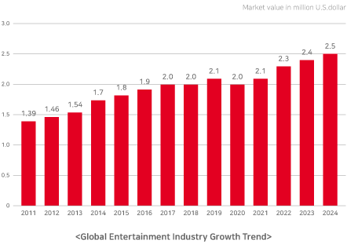

# Hallyu Culture Market

K-POP is now a proper pronoun. It has become a genre that people around the world listen to by dominating Europe and the United States beyond China, Japan, and Southeast Asia. K-POP, which started in East Asia in the early 2000s, has recently been at the peak of BTS (BTS) and Black Pink. Those who swept the Billboard charts are icons of national prestige, and on the other hand, industrial forces. BTS and BLACKPINK's economic impact in an era where content has become a future media food is truly "dynamite."

&#x20;According to Forbes, a globally influential U.S. media company, BTS is considered a celebrity with a GDP generation effect of $4.65 billion (5.18 trillion won). This is 0.2 percent of Korea's GDP last year, which is equivalent to sales of most large companies. The Korea Culture and Tourism Institute under the Ministry of Culture, Sports and Tourism estimated that BTS' new song "Dynamite" would reach 1.7 trillion won in economic value when it topped the Billboard charts. The figure is the sum of direct and indirect added values such as sales of related products as well as profits from music sales. It is estimated that the job creation effect will also reach 8,000 people.

&#x20;Many people are worried about the unstable situation in the post-Corona era, but it is time for founders as innovators to seize the opportunity, and new technologies of the 4th Industrial Revolution are actively converging with content such as K-POP, opening new business opportunities.

&#x20;Beyond the limits of enjoying music with hearing and vision, a new entertainment world without the boundary between real and virtual spaces is opening.

&#x20;Digitalization of music 20 years ago brought about a crisis of the collapse of the domestic music market, but now it has emerged as a key IP in the Metaverse world due to digitalization and is being reevaluated.
