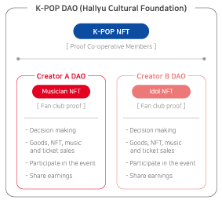

# K-POP NFT, COIN

&#x20;In the case of the K-POP industry, the spread of fan culture is the expansion of purchases, and the demand for CD products continues to be maintained (IP revenue). In the past, it was only an appearance fee and advertising revenue, but in recent years, IP-based businesses in K-POP have grown to play a role in the revenue structure as stars' products such as cheering tools, portrait rights, and goods using characters have made high profits.

&#x20;In K-POP DAO, it is recognized as a member of DAO by owning NFT, a condition of participation, and K-POP COIN was issued for a key role so that anyone in the world can use it easily and conveniently.

.png>)

&#x20;Goods, NFT, and offline tickets are sold through KPOP NFT Market, which can only be purchased with K-POP COIN. When purchasing, members who own NFT provide priority and discounts, and when planning creator goods products, sales production products (designs, etc.) are decided by voting through DAO voting rights, and a certain portion of K-POP NFT MARKET sales proceeds are shared.

&#x20;In order to support specific creators within K-POP DAO, K-POP COIN can be deposited to serve as a supporter, and fan club limited NFT can be purchased. NFT, which proves to be a member of the creator's fan club, will be conducted as a limited sale, and priority will be given along with purchase benefits such as goods and music sources.

&#x20;In addition, in the case of fan club limited NFT, the benefits can be transferred by selling them to others in the future.

&#x20;As a result, the market is expected to grow as fandom through K-POP COIN actively enters.

&#x20;Not only NFT products but also real tickets with high K-POP-related purchase competition can be purchased first.

&#x20;In addition, as NFT goods are sold, a certain percentage of rewards can be received.

&#x20;Initially, it may be a small user or market, but the goal is to continuously expand its size through various promotions and marketing to expand the liquidity of K-POP COIN and at the same time to increase the market's transaction size itself.

&#x20; Just as each and every one of us gets together to accomplish a big thing, we aim for a virtuous cycle as the number of members increases&#x20;

&#x20;DAO members, to help members promote themselves and take rewards for public purposes

&#x20;Various events are being planned.

.png>)

&#x20;

.png>)

