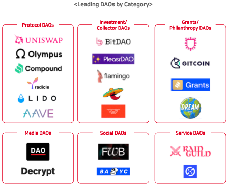

# DAO 활용 사례

DAO는 탈 중앙화 자율조직을 의미한다.

블록체인 상의 스마트 컨트랙트를 통해 강제적으로 시행하는 규칙을 통해 의사결정과 운영이 이루어지는 조직이다.

DAO의 가장 중요한 특징이자 장점은 투명성이다.

누구든지 DAO의 모든 활동 내역을 손쉽게 볼 수 있기 때문에 전통적인 구조의 회사보다 더 투명하다.

&#x20;링크다오(LinksDAO)는 골프장 매입을 위한 NFT 컬렉션을 판매하며, 소유한 사람은 멤버가 되어 골프장 멤버십을 구매할 수 있는 권한과 이용료 할인, 회원 전용 커뮤니티 참여권 등의 여러 특전을 제공하고 이윤을 분배한다.

&#x20;메타팩토리는, 패션 문화 관련 제품을 디자이너가 디자인하고, 맴버가 투표를 통해 선정해 제품을 제작 판매하며. 판매한 수익금을 공유한다. 이로써 디자이너는 더욱 열심히 디자인하며, 투표자들은 좋은 디자인 투표와 함께 개인적인 홍보도 함께 이뤄진다.

그 결과, 이런 구조의 선순환으로 판매량은 더욱 많아져 더 많은 수익금을 공유한다

그 밖에도 다양한 상품과 실물 자산, 프로젝트 등이 DAO의 조직형태로 운영되고 있다.

