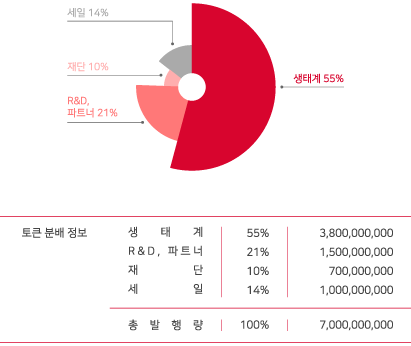

# 토큰 정보 요약

**Klay 기반**

발행량 : 7,0000,000,000 (70억개)

심 볼 : K-POP

코인명 : K-POP COIN Klay

Contract Address : 0x0af4dbf035e287736c9cd52b2b50a423e097a027

Block Explorer: [https://scope.klaytn.com/token/0x0af4dbf035e287736c9cd52b2b50a423e097a027?tabId=tokenTransfer](https://scope.klaytn.com/token/0x0af4dbf035e287736c9cd52b2b50a423e097a027?tabId=tokenTransfer)

