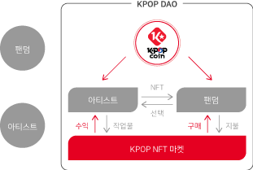
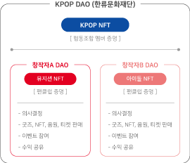
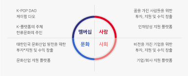

# K-POP NFT, COIN

K-POP 산업의 경우 팬 문화 확산이 구매 확대로, CD 상품 수요도 계속 유지되는 경향 (IP 수익)이다. 과거에는 출연료, 광고 수익 등에 불과했으나, 최근에는 응원 도구나 초상권, 캐릭터 등을 활용한 굿즈(Goods) 등 스타의 IP(Intellectual Property) 활용 상품이 높은 수익을 올려감에 따라 K-POP에서 IP 기반사업이 수익구조의 한 축을 담당할 정도로 크게 성장했다.

K-POP DAO에서는 참여조건인 NFT를 소유함으로써 DAO의 멤버로 인정되며, 전 세계 누구나 쉽고 편리하게 사용할 수 있도록 K-POP COIN을 기축 역할을 위해 발행되었다

K-POP NFT MARKET(가칭)을 통해 굿즈 및 NFT와 오프라인 티켓 등을 판매하며, 이는 오직 K-POP COIN으로만 구매할 수 있다. 구매 시 NFT를 소유한 멤버의 경우 우선권과 할인 혜택을 제공하며, 창작자 굿즈 상품을 기획할 때 DAO 투표권을 통해 판매 제작 상품(디자인 등)을 투표로 결정하고, K-POP NFT MARKET 판매 수익금의 일정 부분을 공유 받는다.

K-POP DAO 안에서 특정 창작자를 서포트 하기 위해 K-POP COIN을 예치해 서포터 역할을 할 수 있으며, 팬클럽 한정 NFT를 구매할 수 있다. 해당 창작자의 팬클럽 멤버임을 증명하는 NFT는 한정 판매로 진행되고, 굿즈 및 음원 등의 구입 혜택과 함께 우선권이 주어진다.

또한 팬클럽 한정 NFT의 경우 추후에 타인에게 판매를 함으로써 그 혜택을 양도할 수 있다.

이 결과 K-POP COIN을 통한 팬덤들이 적극적으로 진입하여 시장은 커질 것으로 예상된다.

&#x20;NFT 상품들뿐만 아니라 K-POP 관련 구매 경쟁률이 높은 실물 티켓들도 우선적으로 구매할 수 있다.

또한 NFT 굿즈 상품들이 판매됨에 따라 일정 비율의 리워드 받을 수 있다.

초기에는 소규모의 이용자, 마켓일 수 있으나 각종 홍보, 마케팅을 통하여 그 크기를 지속적으로 확대하여 K-POP COIN의 유동성을 확대를 꾀하는 동시에 마켓의 거래 규모 자체도 키워 나가는 것을 목표로 한다.

한 사람, 한 사람이 모여 큰일을 이뤄가듯이 회원이 많아질수록 선순환하는 구조를 지향하기에 DAO 구성원, 회원들이 공공의 목표를 위해 스스로 홍보하고 보상을 가져갈 수 있도록 다양한 이벤트를 기획중에 있다.

