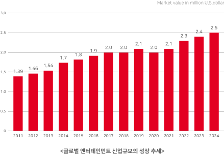

# 한류문화 시장

K-POP은 지금 하나의 고유대명사가 되었다. 중국과 일본, 동남아 지역을 넘어 유럽과 미국까지 장악하며 세계인이 듣는 하나의 장르로 발돋움했다. 2000년대 초 동아시아를 중심으로 시작된 K-POP 은, 최근 그 정점을 방탄소년단(BTS)과 블랙핑크가 맡고 있다. 빌보드차트를 휩쓴 이들은 국위선양의 아이콘이면서, 또 한편으로는 산업역군이다. 콘텐츠가 미래 미디어 먹거리가 된 시대에 BTS와 블랙핑크의 경제적 파급력은 가히 '다이너마이트'급이다

세계적으로 영향력이 있는 미국의 미디어기업 ‘포브스’ 에 따르면 BTS는 46억 5,000만 달러(5조 1,800억 원)의 국내총생산(GDP) 창출 효과를 지닌 유명인물로 평가 받는다. 이는 지난해 한국 GDP의 0.2% 수준으로, 웬만한 대기업의 매출과 맞먹는다. 문화체육관광부 산하 한국문화관광연구원은 BTS의 신곡 '다이너마이트'가 빌보드 1위를 차지했을 때 그 경제적 가치가 1조 7,000억 원에 이를 것으로 추산했다. 음원 판매의 수익은 물론, 관련 제품 판매 등 직간접적인 부가가치를 합한 수치다. 이를 통해 발생하는 고용창출 효과도 8,000여명에 달할 것으로 추산됐다.

많은 사람들이 포스트 코로나 시대의 불안정한 상황을 걱정하지만 혁신가로서의 창업자들은 지금이 기회를 포착할 때다 마침 4차 산업혁명의 신기술들이 K-POP과 같은 콘텐츠와 활발히 융합되어 새로운 비즈니스 기회들이 열리고 있다.

청각과 시각으로 음악을 즐기는 한계를 넘어, 현실 공간과 가상 공간의 경계가 없는 새로운 엔터테인먼트 세상이 열리고 있는 것이다.

20년 전 음악의 디지털화는 국내 음반시장 붕괴라는 위기를 가져왔지만 현재는 디지털화로 인해 메타버스세상에서 핵심 IP로 급부상 하여 재 평가 받고 있다.
